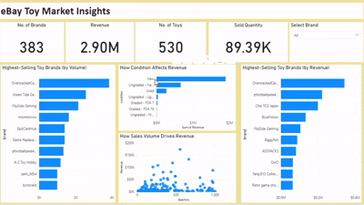

# 🧸 eBay Toy Market Analysis — Web Scraping & Power BI

This project explores the online toy market on eBay by collecting product data through web scraping and analyzing it using Power BI.It identifies top-selling brands, price-performance trends, and insights into consumer preferences based on product condition and revenue.

## 📌 Table of Contents
- [Overview](#overview)
- [Objectives](#objectives)
- [Tools & Technologies](#tools--technologies)
- [Scraping Process](#scraping-process)
- [Data Features](#data-features)
- [Analysis & Visualizations](#analysis--visualizations)
- [Future Work](#future-work)

---

## 🎯 Objectives

- Scrape product listings from eBay’s toy section using Selenium
- Extract relevant information like price, condition, brand, units sold
- Store and clean data for analysis
- Visualize findings in Power BI for actionable insights

---
## 🧰 Tools & Technologies

- **Python** (Selenium, Pandas)
- **Selenium WebDriver** for dynamic scraping
- **Power BI** for data transformation and dashboard creation

## 🧾 Overview

eBay hosts thousands of toy listings varying by brand, price, condition, and seller strategy. This project aims to help understand:
- Which toys are selling the most
- How condition and pricing influence revenue
- What constitutes a “great deal” from a buyer’s perspective

---

## 🕸 Scraping Process

- Target site: [eBay Toys & Hobbies](https://www.ebay.com/b/Toys-Hobbies/220/bn_1865497)
- Pagination handled to navigate multiple result pages
- Individual listing pages accessed to extract full product info
- Data extracted includes:
  - Product name
  - Brand (based on seller info)
  - Condition (New/Used/Graded)
  - Price
  - Quantity sold

## 🧮 Data Features

| Column           | Description                           |
|------------------|---------------------------------------|
| `product_name`   | Name of the toy                       |
| `brand`          | Seller/Brand name                     |
| `condition`      | New, Used, Graded                     |
| `price`          | Price per item (numeric)              |
| `quantity_sold`  | Total units sold                      |

---

## 📊 Analysis & Visualizations

  

- **Top 10 Best-Selling Brands** by quantity sold
- **Top 10 Best-Selling Brands** by revenue 
- **Total Revenue by Toy Condition**
- Quantity Sold vs Revenue

  

---
## 🚀 Future Work

This project lays the foundation for deeper e-commerce analysis. Future enhancements may include:

- 📦 **Cross-Market Comparison**  
  Compare toy prices and availability between eBay and other platforms like Amazon, Walmart, or Target.

- 💬 **Sentiment Analysis on Reviews**  
  If review data is added, analyze customer sentiment to evaluate product satisfaction.

- 🧮 **Sales Forecasting**  
  Use machine learning to predict which types of toys are likely to sell more in the future based on historical trends.

